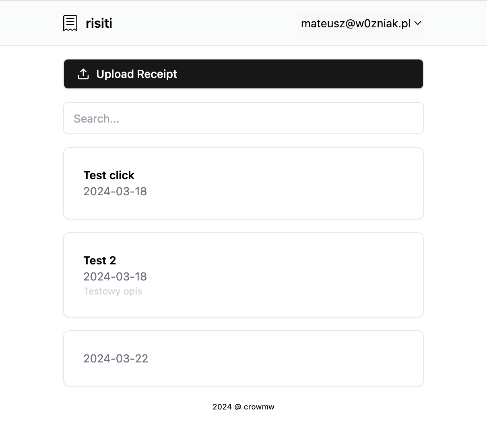

# Risiti




Self-hosted application for collecting receipts. A simple application that allows you to upload a receipt with a few clicks, or search for already uploaded ones. The receipt files are deposited as regular files on your own server (in my case, a Synology), which already takes care of backing up and storing these files.

Created as part of GO and HTMX learning.

### Technologies

- GO
- HTMX
- Chi
- Templ
- Tailwind
- SQLite3

## Usage

**On first run you need to create first user (admin) of application.**

docker-compose:

```
---
services:
  risiti:
    image: crowmw/risiti:latest
    container_name: risiti
    environment:
      - SECRET=secretKey
    volumes:
      - /path/to/risiti/data:/data
    ports:
      - 80:80
    restart: unless-stopped
```

docker cli:

```
docker run -d \
  --name=risiti \
  -e SECRET=secretKey \
  -p 80:80 \
  -v /path/to/risiti/data:/data \
  --restart unless-stopped \
  crowmw/risiti:latest
```

## Contributing

PRs accepted.

## License

MIT © Mateusz Woźniak
